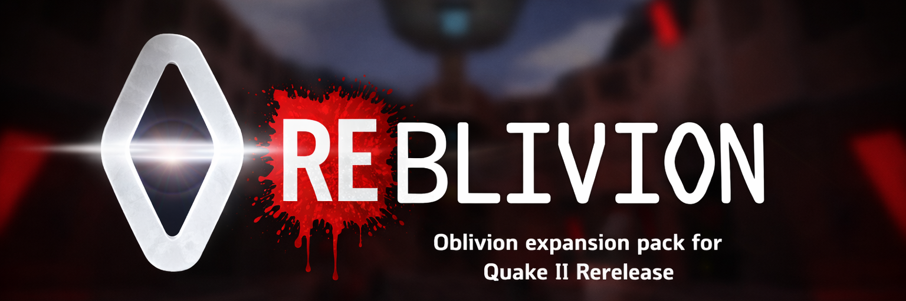

  

  <h1>REBLIVION</h1>
  
<strong>A Quake II Rerelease port of Oblivion, focused on compatibility first and gradual enhancement over time.</strong>

  

    
    
    
    
  

  

    <a href="#project-goal">Project Goal</a>
    &nbsp;·&nbsp;
    <a href="#project-status">Project Status</a>
    &nbsp;·&nbsp;
    <a href="#roadmap">Roadmap</a>
    &nbsp;·&nbsp;
    <a href="#runtime-target">Runtime Target</a>
    &nbsp;·&nbsp;
    <a href="#installation">Installation</a>
    &nbsp;·&nbsp;
    <a href="#building-from-source">Build From Source</a>
    &nbsp;·&nbsp;
    <a href="#repository-layout">Repository Layout</a>
  

<h2 id="project-goal">Project Goal</h2>

  <strong>REBLIVION</strong> exists to bring Oblivion to <strong>Quake II Rerelease</strong> and gradually enhance it for modern audiences.

  In practice, that means keeping the original mod's identity intact while improving the parts that benefit from rerelease-era work:
  compatibility, packaging, presentation, map touch-ups, and steady quality-of-life improvements shaped by real testing.

<h2 id="project-status">Project Status</h2>

  The project is already in a <strong>solid, playable state</strong>. The rerelease DLL builds, the asset pack is assembled into
  <code>pak0.pak</code>, the intro media is staged for release archives, and the repository contains a substantial amount of
  gameplay and content work rather than a thin bootstrap shell.

  It is <strong>not</strong> being presented as fully settled. Broader map-by-map playtesting, extended campaign validation,
  edge-case gameplay checks, and ongoing refinements are still needed before the port should be treated as comprehensively verified.

<h2 id="roadmap">Roadmap</h2>

<table>
  <thead>
    <tr>
      <th align="left">Item</th>
      <th align="left">Status</th>
      <th align="left">Notes</th>
    </tr>
  </thead>
  <tbody>
    <tr>
      <td>Oblivion compatibility</td>
      <td><strong>Done</strong></td>
      <td>The rerelease port is up and running as a real playable project rather than a partial bootstrap.</td>
    </tr>
    <tr>
      <td>Q2Re texture <code>.mat</code> material files</td>
      <td><strong>Done</strong></td>
      <td>Material support is in place for rerelease-friendly texture behavior.</td>
    </tr>
    <tr>
      <td>Q2Re glow maps</td>
      <td><strong>Done, not final</strong></td>
      <td>Glow support exists, but visual tuning and cleanup are still expected.</td>
    </tr>
    <tr>
      <td>Map remastering</td>
      <td><strong>In progress</strong></td>
      <td>Maps are being revisited and refined as the port matures.</td>
    </tr>
    <tr>
      <td>Ongoing enhancements</td>
      <td><strong>In progress</strong></td>
      <td>Testing-driven fixes, polish work, and quality improvements continue alongside broader validation.</td>
    </tr>
  </tbody>
</table>

  If you run into a bug or have a good idea for the port, please submit it through <strong>GitHub Issues</strong>.
  Bug reports and enhancement requests are both useful, especially now that the project is at the stage where real testing feedback matters.

<h2>What This Repository Contains</h2>

<ul>
  <li>The rerelease game-module source in <code>src/</code>, including the Windows x64 DLL target and gameplay code.</li>
  <li>Editable map sources under <code>src/maps/</code> and packaged runtime assets under <code>pack/</code>.</li>
  <li>Packaging tools that build <code>pak0.pak</code>, stage local installs, and publish nightly archives.</li>
  <li>Editor support assets under <code>editor/</code>, including committed NetRadiant-Custom and TrenchBroom packs for the <code>reblivion</code> mod.</li>
  <li>A standalone release document in <code>docs/release-readme.html</code> that is copied into release archives as <code>README.html</code>.</li>
  <li>Preserved reconstruction and reverse-engineering reference material under <code>references/Oblivion-reverse/</code>.</li>
</ul>

<h2 id="runtime-target">Runtime Target</h2>

  This repository is currently scoped to the <strong>Windows x64</strong> Quake II rerelease target.
  The produced module is <code>game_x64.dll</code>, and the nightly packaging flow wraps it into a ready-to-extract
  <code>reblivion/</code> directory.

<table>
  <thead>
    <tr>
      <th align="left">Target</th>
      <th align="left">Produced Output</th>
      <th align="left">Notes</th>
    </tr>
  </thead>
  <tbody>
    <tr>
      <td>Windows x64 Quake II rerelease</td>
      <td><code>game_x64.dll</code></td>
      <td>The current solution, build scripts, and GitHub nightly workflow all target the rerelease DLL and package it with <code>pak0.pak</code>, loose intro media, and a standalone HTML readme.</td>
    </tr>
  </tbody>
</table>

<h2 id="installation">Installation</h2>

<h3>Install From A Release Archive</h3>

<ol>
  <li>Locate your Quake II rerelease installation root, where the existing <code>baseq2/</code> folder lives.</li>
  <li>Download the latest REBLIVION release archive for Windows x64.</li>
  <li>Extract the archive into the rerelease root so the bundled <code>reblivion/</code> directory lands beside <code>baseq2/</code>.</li>
  <li>Allow files inside <code>reblivion/</code> to be replaced if you are updating an earlier build.</li>
  <li>Launch the rerelease with <code>+set game reblivion</code>.</li>
</ol>

Each release archive includes:

<ul>
  <li><code>game_x64.dll</code></li>
  <li><code>pak0.pak</code></li>
  <li><code>video/obintro.cin</code>, <code>video/obintro.ogv</code>, and subtitle files</li>
  <li><code>README.html</code></li>
  <li><code>VERSION.txt</code></li>
  <li>the local banner asset used by the packaged HTML readme</li>
</ul>

  The packaged rerelease build already carries this repository's Oblivion data inside <code>pak0.pak</code>.
  In other words: end users install the archive into the rerelease root and run it there; they do not need to assemble a separate retail-era Oblivion directory first.

<h3>Expected Layout After Extraction</h3>

<pre><code>rerelease/
  baseq2/
  reblivion/
    game_x64.dll
    pak0.pak
    README.html
    VERSION.txt
    assets/
      reblivion-banner.png
    video/
      obintro.cin
      obintro.ogv
      obintro.srt
      obintro_de.srt
      obintro_es.srt
      obintro_fr.srt
      obintro_it.srt
      obintro_ru.srt
</code></pre>

<h2 id="building-from-source">Build From Source</h2>

The short version is below. The repository is set up for a Visual Studio and PowerShell based Windows x64 build flow.

<h3>Prerequisites</h3>

<ul>
  <li>Visual Studio 2022 or newer with MSBuild, the v143 toolset, and a recent Windows SDK.</li>
  <li>A manifest-aware <code>vcpkg</code> checkout with <code>VCPKG_ROOT</code> set.</li>
  <li>Python 3 for <code>tools/make_pak.py</code> and the packaging scripts.</li>
  <li>A local Quake II rerelease install if you want to stage and run the mod immediately after building.</li>
</ul>

<h3>Build The DLL</h3>

<pre><code>$env:VCPKG_ROOT = "C:\src\vcpkg"
&amp; "$env:VCPKG_ROOT\vcpkg.exe" install --triplet x64-windows-static
powershell -ExecutionPolicy Bypass -File .\tools\build_game.ps1
</code></pre>

  The repository root output is <code>game_x64.dll</code>. If you prefer the IDE flow, open <code>game.sln</code> and build the
  <code>Release|x64</code> configuration.

<h3>Stage A Local Dev Install</h3>

<pre><code>powershell -ExecutionPolicy Bypass -File .\tools\install_oblivion_dev.ps1
</code></pre>

  That script stages a ready-to-run build under <code>.install/reblivion/</code>, rebuilds <code>pak0.pak</code>,
  copies the intro media, and updates or links the default Steam rerelease install when that path exists on the local machine.

<h2>Nightly Releases</h2>

  GitHub Actions publishes a Windows x64 nightly archive from the semantic base version stored in <code>VERSION</code>.
  Release tags append a nightly timestamp and commit suffix in the form
  <code>v&lt;base-version&gt;-nightly.YYYYMMDD.HHMMSS.g&lt;commit&gt;</code>.

  The current base version in this repository is <code>0.1.0</code>. Treat that as an indicator of ongoing validation rather than an empty early prototype:
  the project has real substance already, but it still needs testing and continued cleanup work.

  Nightly releases also publish a separate <strong>level-design archive</strong>. That archive contains nested
  <strong>NetRadiant-Custom</strong> and <strong>TrenchBroom</strong> zips, each arranged to extract directly into the
  corresponding editor root while targeting the <code>reblivion</code> mod on top of <code>baseq2</code>.

  Both editor packs start from the stock Quake II rerelease definitions and append a generated runtime delta from the
  current <code>src/</code> tree, using <code>references/Oblivion-reverse/pack/oblivion.c</code> only as a metadata fallback.
  That keeps the full retail q2re surface available while also documenting the extra rerelease/runtime and REBLIVION-specific
  entities level designers can actually use in this project.

<h2 id="repository-layout">Repository Layout</h2>

<table>
  <thead>
    <tr>
      <th align="left">Path</th>
      <th align="left">Purpose</th>
    </tr>
  </thead>
  <tbody>
    <tr>
      <td><code>src/</code></td>
      <td>Rerelease game-module source code plus supporting gameplay systems.</td>
    </tr>
    <tr>
      <td><code>src/maps/</code></td>
      <td>Editable map source files used for map fixes and rebuilds.</td>
    </tr>
    <tr>
      <td><code>pack/</code></td>
      <td>Runtime content packed into <code>pak0.pak</code>, plus loose intro video assets staged for releases.</td>
    </tr>
    <tr>
      <td><code>editor/</code></td>
      <td>Committed editor integration assets, currently including NetRadiant-Custom and TrenchBroom support plus the generated runtime delta FGDs for the <code>reblivion</code> mod.</td>
    </tr>
    <tr>
      <td><code>tools/</code></td>
      <td>Build, install, pack-generation, and nightly release automation scripts.</td>
    </tr>
    <tr>
      <td><code>docs/</code></td>
      <td>User-facing documentation, including the standalone HTML release readme and its banner asset.</td>
    </tr>
    <tr>
      <td><code>references/Oblivion-reverse/</code></td>
      <td>Preserved reverse-engineering and reconstruction material carried forward as reference context.</td>
    </tr>
    <tr>
      <td><code>.github/workflows/</code></td>
      <td>Nightly Windows x64 packaging and release publication workflow.</td>
    </tr>
    <tr>
      <td><code>.install/</code> and <code>dist/</code></td>
      <td>Locally staged installs and generated release archives.</td>
    </tr>
  </tbody>
</table>

<h2>Credits And Attribution</h2>

  Original creative credit remains with the original <strong>Oblivion</strong> release by <strong>Lethargy Software</strong>.
  REBLIVION is a rerelease porting and packaging effort built on top of that work.

  The original Oblivion team credits remain worth preserving in modern form:

<table>
  <thead>
    <tr>
      <th align="left">Discipline</th>
      <th align="left">Original Team</th>
    </tr>
  </thead>
  <tbody>
    <tr>
      <td>Programming</td>
      <td>Mike "Gripp" Ruete; Tim "Argh" Wright</td>
    </tr>
    <tr>
      <td>Level Design</td>
      <td>Dan "Infliction" Haigh; Alex "MonkeyDonut" Gingell; Dan "Trebz" Nolan; Sean "Spider" Soucy</td>
    </tr>
    <tr>
      <td>Artwork</td>
      <td>John "MetalSlime" Fitzgibbons; Tyler "Witz" Wilson; Eli "Dunan" Karney; SmokyG</td>
    </tr>
    <tr>
      <td>Models</td>
      <td>Andrew "Betlog" Eglington; Matt Hasselman; John "Jonny" Gorden; Rorshach</td>
    </tr>
    <tr>
      <td>Music</td>
      <td>Carl "Dill" Bown</td>
    </tr>
    <tr>
      <td>Website / Manual</td>
      <td>Ryan "BabelFish" Freebern</td>
    </tr>
  </tbody>
</table>

<h2>License</h2>

This repository is distributed under the GNU General Public License v3. See <a href="LICENSE">LICENSE</a> for details.

